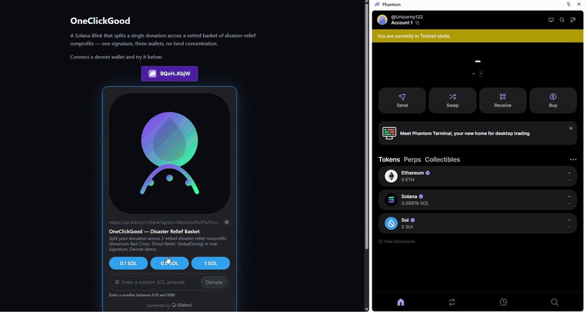
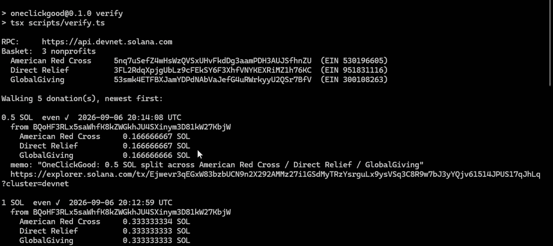

# OneClickGood — a donation Blink that splits to a vetted basket

**Live:** https://oneclickgood.vercel.app · **On-chain ledger:** https://oneclickgood.vercel.app/ledger
*Submission for the [DEV Weekend Challenge: Generosity Edition](https://dev.to/challenges/weekend-2026-09-03) — Best Use of Solana.*

A Solana Blink that splits one donation evenly across three vetted disaster-relief nonprofits —
**one signature, three recipients, one atomic transaction**.

Charitable giving concentrates on whoever is most visible during a disaster. Splitting a gift by hand
across three organisations means three websites and three checkout forms, so nobody does it. This makes
the split the default instead of the effort — and because it is three `SystemProgram.transfer`
instructions in a single transaction, the even split is enforced by the runtime rather than promised
by the operator. Either all three are funded or none are.



## What's here

| | |
| --- | --- |
| `GET /api/actions/donate` | Blink metadata — icon, title, preset and custom amounts |
| `POST /api/actions/donate?amount=<SOL>` | Builds the unsigned split transaction + SPL Memo, and chains to the completion step |
| `POST /api/actions/donate/complete` | Reads the confirmed transaction back off devnet and reports the amounts the chain recorded |
| `GET /actions.json` | Actions rules mapping this domain's `/api/actions/**` paths |
| `/ledger` | Every donation, read live from devnet at request time |
| `npm run verify` | Independent audit using only an RPC node — see below |

There is **no database**. Devnet is the only state; every number the site reports is derived from the
chain when you load the page.

## Audit it yourself

`npm run verify` talks to a Solana RPC node and nothing else — not this website, not any server of mine.
Given only the three charity wallet addresses, it walks every donation, decodes the memo, recomputes
each split from the transaction's own `preBalances`/`postBalances`, and **exits non-zero if any donation
was not an even three-way split**.

```bash
npm run verify
npm run verify -- --rpc https://your-node --limit 50
```



## Getting started

```bash
npm install
npm run generate-wallets   # one-time: creates the 3 devnet charity wallets
npm run dev                # http://localhost:3000
```

`keypairs/` is gitignored, so a fresh clone has no wallets — `generate-wallets` creates them, and
`src/lib/charity-wallets.json` (public keys only) is regenerated to match.

Charity names, descriptions, logos and websites in `src/lib/charity-metadata.json` ship with static
defaults and can be refreshed from the [Every.org nonprofit API](https://www.every.org/charity-api) by
EIN (free public key required):

```bash
EVERY_ORG_API_KEY=pk_... npm run fetch-charity-metadata
```

### Proving the split lands on-chain

`npm run verify-onchain` runs the full loop against a persisted devnet donor wallet at
`keypairs/verifier-donor.devnet.json`: it calls this app's own `POST /api/actions/donate`, signs the
returned transaction, submits it, and prints each charity's balance before and after plus an explorer
link. If the public airdrop faucet is dry, fund the printed address at
[faucet.solana.com](https://faucet.solana.com/) and re-run.

```bash
APP_URL=http://localhost:3000 npm run verify-onchain
```

### Rendering the Blink

The Blink renders and signs **on this site** via Dialect's `@dialectlabs/blinks` client, so the demo
does not depend on a third-party interstitial being reachable. (The original plan was to demo through
`dial.to`; that domain stopped resolving mid-build, which is why the client is embedded directly.)

The endpoint is still a spec-conforming Solana Action, so it works in any Blink client:

```
https://<any-blink-client>/?action=solana-action:https://oneclickgood.vercel.app/api/actions/donate
```

## A note on scope

These are **devnet wallets generated by this repo**, not addresses controlled by the American Red Cross,
Direct Relief or GlobalGiving, and devnet SOL is not money. This is a proof of the mechanism — that a
one-signature, multi-recipient, independently auditable donation is a real primitive — not a live
fundraising channel. Making it real is a wallet-custody and trust problem, not a code problem.

## Stack

Next.js App Router on Vercel · `@solana/actions` · `@solana/web3.js` · `@dialectlabs/blinks` +
wallet-adapter · TypeScript.
